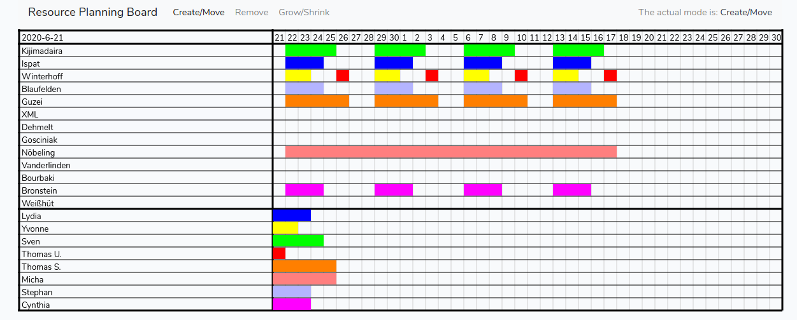

# Electronic Magnetic Planning Board

The Electronic Magnetic Planning Board replicates a magnetic planning board on the computer.
"Electronic" is what it is.
"Magnetic" is what it replicates.

This means that the utilization of resources can be
planned by placing bars on them.
This is implemented with a gantt chart.
Of course there are already many planning tools based on gantt charts.
What distinguishes our tool from them is its simplicity and intuitive usage.
Just like on a magnetic planning board, you can attach and remove bars and move them back and forth.

The bars and the resources can be built up with a simple master data tool.

The application is a browser-based single page app. The frontend is coded with
[Vue.js](https://vuejs.org/).
The server part is a SQL based [Laravel](https://laravel.com/)-API.

Since the data are stored centrally on a server, the tool can handle multiple users at different client workstations.
However, there isn't yet any app specific mechanism to avoid access conflicts.
For now this has to be done by phone, Skype or similar means.
In the future the app will offer its own support for this.

The app can't handle touch events yet. A phone screen is too small for this app anyway.
But it should run on a tablet and this is in the pipeline.

# Prerequisites
The server requirements are the same as for Laravel
(on which the whole thing is based) <https://laravel.com/docs/6.x#server-requirements>
If you are on current Ubuntu LTS (18.04) just install mysql, apache, php, git and composer.

You need sqlite3 and php-sqlite3 additionally for running tests.
(The repo comes with it's own PHPUnit, so you don't need to install it.
But you need sqlite3. We use an in memory sqlite DB for testing instead of mocking the
DB connection.)

For frontend development, you further need nodejs and npm.

# Installation

    git clone https://github.com/ThomasJez/ResourcePlanningBoard.git
    cd ResourcePlanningBoard
    composer install

create the .env file:

    cp .env.example .env

edit the DB settings and create an empty DB according to your settings

    php artisan migrate
    php artisan db:seed
    php artisan key:generate

# Tests
Run

    vendor/bin/phpunit

# Frontend Development
If you want to do frontend development, you have to run:

    npm install
    npm run dev

# Example Scenarios
Three example scenarios are provided.  They can be activated via:

    php artisan migrate:refresh
    php artisan db:seed (--class=<Szenario>)

(Attention: migrate:refresh empties the database completely!).

## Default Scenario
The simplest scenario consists of one resource and one rule. From there you can build your own scenario.

Activate with:

    php artisan migrate:refresh
    php artisan db:seed

## Workshop Scenario
Here, the resources are machines and the rules are orders. One can allocate resouces
for orders.

    php artisan migrate:refresh
    php artisan db:seed --class=WorkshopSzenarioSeeder

## Jobber Scenario
Here the resources are projects and the rules are part time employees. One can schedule and visualize which
employee works when at which project.
The screenshot below comes from this scenario.

    php artisan migrate:refresh
    php artisan db:seed --class=JobberSzenarioSeeder

# Components of the App
There are the main view, some master data editors and also
a separate maintenance tool, which is not part of the single page app.

# The Main View

(The screenshot is from the "Jobber scenario")
The main view consists of the mode menu, the timeline,
the activities area and the rules area.
In the Jobber scenario, each resource represents a book project, each "rule" represents a typesetter, and each
activity the work of a
typesetter on the corresponding book project.
In the screenshot you can see that Sven works four days a week on the Kijimadaira project, Lydia three days a week on
Ispat etc.

## Components of the Main View
### Mode Menu
At the top is the mode menu, where you can switch between the modes Create/Move, Delete and Grow/Shrink
Depending on the selected mode, you can create, move, delete and modify activities.

### Timeline
The timeline is below the mode menu and consists of the start date on the
left side and a field for every day on the
on the right side.
You can currently only plan by day, but the smallest possible planning period will
become configurable.

With a click on the start date a
form can be opened, which allows moving of the
start date forward and backward.

### Activities Area
The activities area consists of several lines, one line for each resource.
Like the timeline, each line is divided into two parts. The left part contains the resource name, the right part
contains the
graphical representation of the activities. Each activity is represented by a colored bar.
By clicking on the resource name, a form for the respective resource opens.
The activities on the right side can be manipulated with the mouse (see below).

### Rules Area
The rules area at the very bottom contains a line for
every rule.
The left area contains the name of the rule, the right area contains the graphical representation of the rule.
A rule is a
blueprint for an activity.
By clicking on the rule name, a form for the respective rule opens.

## Using the Main View

Create an activity: click on a rule with the mouse in the selected Create/Move mode and
move it into the activities area. Where you release the mouse, an activity is created.

If you click on an activity instead of a rule and move it to a different position in the activities area, the activity
will be moved.

If you click on an activity in Delete mode, the activity is deleted.
If you click on an activity in Grow/Shrink mode, you can drag it longer or shorter while holding down the mouse button.

# Master Data Editors
If you click on the labels on the left side of the main view, a form for the clicked
resource or rule (or the start date if you click on the top) opens.
In the resource and rule form, you can create, change and delete resources and rules,
and you can also open a further form from there, where you can reorder rules and resources.

# Maintainance Tool
There are two small tools outside of the single page app:
<url of the app>/maintainance opens a  page, where a "term editor" and a "cleanup tool" can be found in the menu.

With the term editor, the terms for resources
(here in this example "book projects")
and rules (in this example "typesetters") can be changed.
These terms appear in the master data editors.

You can use the cleanup tool to delete all activities that end before the start of the plan (these occur
after moving the start date).
